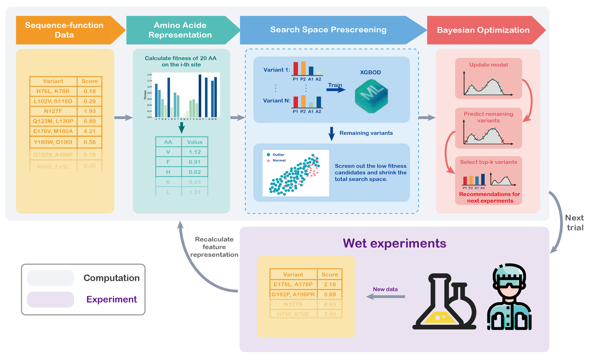

# Bayesian optimization with search space prescreening via outlier detection (ODBO)

## Overview
This repository includes the codes and results for our paper:
***ODBO: Bayesian Optimization with Search Space Prescreening for Directed Protein Evolution***

ODBO is written as a **maximization** algorithm to search the best experimental design with desired properties. The initial sample generators and different encodings are also included in this repo.

<p align="center">
  <a href="https://github.com/tencent-quantum-lab/ODBO/figure">
    
  </a>
</p>

## Installation
Please first clone our repo and install using the setup.py. All the dependencies are listed in the ```requirements.txt```.

```
git clone https://github.com/tencent-quantum-lab/ODBO.git
cd ODBO
pip install requirements.txt (if needed)
python setup.py install 
```

## Content list
The descriptions of files in each folder are listed in the corresponding ```README.md``` file in the folder 

* [datasets](datasets) contains the raw data for four protein datasets obtained from the original publications and [nn4dms repo](https://github.com/gitter-lab/nn4dms/tree/master/data).

* [examples](examples) contains the notebooks and selected initial experiments used to collect all the results, and also the results presented in the manuscript.

* [odbo](odbo) contains the source codes of BO, TuRBO and ODBO algroithms

## Run a test or reproduce our work
After installing this repo, jupyter notebooks under [examples](examples) with detailed descriptions of each could be directly run to reproduce some of our results. People could also easily change the global settings within each notebook to produce your own results. 

## Please cite us as
```
@article{cheng2022odbo,
  title={ODBO: Bayesian Optimization with Search Space Prescreening for Directed Protein Evolution},
  author={Cheng, Lixue and Yang, Ziyi and Liao, Benben and Hsieh, Changyu and Zhang, Shengyu},
  journal={arXiv preprint arXiv:2205.09548},
  year={2022}
}
```
